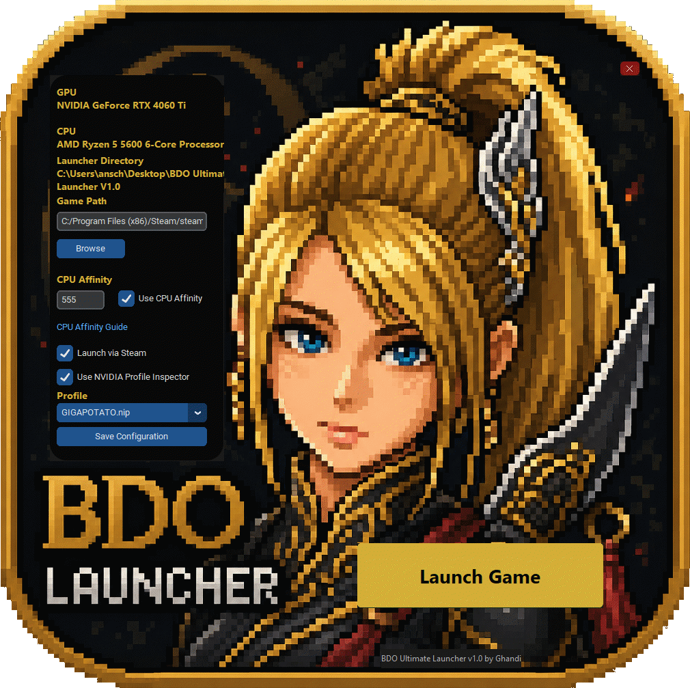

# BDO Ultimate Launcher

------------------------------------------------------------------------------------------------------------------------
BDO Ultimate Launcher does not modify game files,
inject code into the game process, automate gameplay,
or interact with Black Desert Online memory.

The launcher only manages CPU affinity settings,
launch parameters, and optional NVIDIA driver profiles.
------------------------------------------------------------------------------------------------------------------------

Created by AndiGhandi

A lightweight launcher for Black Desert Online featuring:

* NVIDIA Profile Inspector integration
* CPU Affinity support
* Steam and Standalone launch modes
* AMD-compatible mode
* Embedded profiles and assets
* Automatic configuration management
* One-file executable release

------------------------------------------------------------------------------------------------------------------------

NVIDIA Profile Inspector is included solely for convenience.
All rights belong to its respective authors.
See THIRD_PARTY_NOTICES.txt.

------------------------------------------------------------------------------------------------------------------------

First-Time Setup

Before launching Black Desert Online, you must configure the game path.

The launcher requires the folder that contains:

BlackDesertLauncher.exe

Examples:

Steam Version

C:\Program Files (x86)\Steam\steamapps\common\Black Desert Online

Standalone Version

C:\PearlAbyss\Black Desert

or wherever your installation is located.

To configure the path:

1. Launch BDO Ultimate Launcher
2. Click Browse
3. Select the Black Desert installation folder
4. Verify that the selected folder contains BlackDesertLauncher.exe
5. Click Save Configuration

If you are using the Steam Version make sure to tick the Checkbox.

The launcher will automatically remember your settings and store them in:

%APPDATA%\BDO Ultimate Launcher\config.ini

You only need to configure the game path once unless the game is moved to a different location.

Also Check CPU Affinity Guide if you want to use the Affinity feature.

------------------------------------------------------------------------------------------------------------------------

 Why CPU Affinity?

Black Desert Online has historically shown inconsistent CPU thread scheduling behavior.

Even on modern CPUs, the game continues to utilize CPU Core 0 for certain tasks. This can result in:

* Micro stutters
* Frame pacing issues
* Inconsistent frame times
* Reduced responsiveness during combat and large-scale content

By restricting Black Desert Online to a custom CPU affinity mask, many players experience significantly smoother gameplay and more consistent frame times.

This launcher allows you to launch BDO with a custom affinity mask without manually configuring it every time.

------------------------------------------------------------------------------------------------------------------------

 CPU Affinity Guide

For a detailed explanation of CPU Affinity in Black Desert Online, please refer to A Canadian Dude's guide:

https://docs.google.com/document/d/1cyLaDiPL_B6nOZw_qPE_wOGuoeRT-qddTjevTFoFBkg/view?tab=t.0#heading=h.rl325eap4pk9

For newer CPUs, especially modern Intel hybrid CPUs and recent AMD processors, you can calculate your affinity mask using:

https://bitsum.com/tools/cpu-affinity-calculator/

------------------------------------------------------------------------------------------------------------------------

# Important Note

At the time of writing, Black Desert Online still periodically utilizes Core 0 even when it is generally beneficial to avoid it.

This behavior is commonly associated with micro stutters and inconsistent frame pacing.

The affinity configurations used by this launcher are intended to help mitigate these issues, but results may vary depending on hardware configuration, operating system version, and game updates.

------------------------------------------------------------------------------------------------------------------------

 NVIDIA Smooth Motion

This launcher includes support for NVIDIA Smooth Motion profiles.

Official NVIDIA documentation:

https://nvidia.custhelp.com/app/answers/detail/a_id/5621/~/enabling-smooth-motion-in-nvidia-app

  Smooth OFF

The default NVIDIA behavior.

No Smooth Motion profile is applied.

## Smooth ON

Enables NVIDIA Smooth Motion for supported NVIDIA GPUs.

Supported hardware generally includes:

* GeForce RTX 40 Series
* GeForce RTX 50 Series

Please refer to NVIDIA documentation for the latest supported hardware.

------------------------------------------------------------------------------------------------------------------------

# Node War Performance Profiles

The launcher includes additional NVIDIA Profile Inspector profiles.

## SEMIPOTATO

A moderate visibility-focused profile intended for large-scale PvP.

## GIGAPOTATO

A more aggressive visibility-focused profile intended to reduce visual clutter as much as possible.

Examples of optimizations may include:

* Disabling various sprite effects
* Reducing visual overhead
* Adjusting driver-level rendering options

These profiles are primarily designed for:

* Node Wars
* Siege Wars
* Large-scale PvP

They are not guaranteed to provide substantial FPS gains.

On modern hardware, the primary benefit is usually improved visibility and reduced visual clutter rather than dramatically higher frame rates.

## Recommended In-Game Settings

When selecting SEMIPOTATO or GIGAPOTATO, the launcher will display a recommendation popup.

For best results:

* Texture Quality: High
* Graphics: Lowest / Optimal
* Effect Opacity: 30 (minimum value)

These settings generally provide the best experience when using the included Potato profiles.

The popup can be disabled at any time by unticking:

Show Potato Popup

within the launcher.

---

# Custom NVIDIA Profiles

Version 1.0.2 introduces support for custom NVIDIA Profile Inspector profiles.

The launcher automatically monitors the Profiles directory and will detect newly added .nip files without requiring a launcher restart.

Custom profiles are stored in:

%APPDATA%\BDO Ultimate Launcher\Profiles

Example:

C:\Users\YourUsername\AppData\Roaming\BDO Ultimate Launcher\Profiles

## Creating a Custom Profile

1. Launch BDO Ultimate Launcher
2. Click "Create / Edit Custom Profiles"
3. NVIDIA Profile Inspector will open
4. Select the profile:

Black Desert

5. Make your desired changes
6. Click:

Export User Defined Profiles

7. Save the exported .nip file into:

%APPDATA%\BDO Ultimate Launcher\Profiles

The launcher will automatically detect the new profile and add it to the Profile dropdown menu.

NVIDIA Profile Inspector:

https://github.com/Orbmu2k/nvidiaProfileInspector

## Important

Custom NVIDIA profiles are entirely user-created and user-maintained.

If you are not familiar with NVIDIA Profile Inspector settings, it is strongly recommended to stay with the included default profiles:

* Smooth OFF
* Smooth ON
* SEMIPOTATO
* GIGAPOTATO

Incorrect NVIDIA Profile Inspector settings may result in:

* Reduced performance
* Visual glitches
* Driver instability
* Unexpected game behavior

Use custom profiles entirely at your own risk.

The author of BDO Ultimate Launcher does not provide support for arbitrary custom NVIDIA Profile Inspector configurations.

------------------------------------------------------------------------------------------------------------------------

AMD Users

AMD users can use the launcher without NVIDIA Profile Inspector.

Simply disable:

Use NVIDIA Profile Inspector

and continue using:

Use CPU Affinity

to benefit from affinity management without any NVIDIA-specific functionality.

------------------------------------------------------------------------------------------------------------------------

Configuration

The launcher automatically creates its configuration file on first launch:

%APPDATA%\BDO Ultimate Launcher\config.ini

No manual configuration is required.

------------------------------------------------------------------------------------------------------------------------

Disclaimer

This software is provided free of charge and is intended as a community-created utility for Black Desert Online players.

Use of this software is entirely at your own risk.

The author assumes no responsibility or liability for:

* System instability
* Data loss
* Hardware issues
* Software conflicts
* Game performance changes
* Driver-related issues

Always verify your own settings before applying changes.

------------------------------------------------------------------------------------------------------------------------

Third-Party Software

This project may utilize or distribute support files for:

* NVIDIA Profile Inspector
* NVIDIA graphics drivers
* Black Desert Online

All rights remain with their respective owners.

See THIRD_PARTY_NOTICES.txt for additional information.

------------------------------------------------------------------------------------------------------------------------

License

This project is released under the terms described in LICENSE.txt.

Please retain attribution to the original creator:

AndiGhandi – BDO Ultimate Launcher

https://github.com/AndiGhandi/BDO-Ultimate-Launcher
